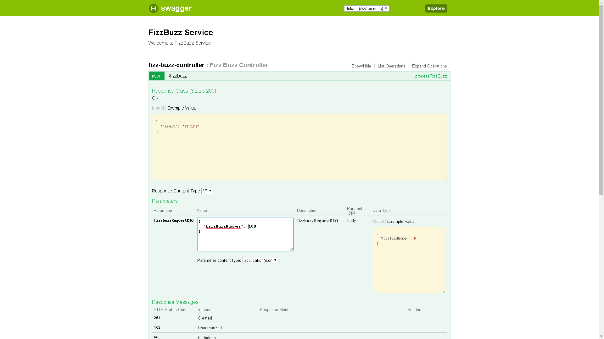

# FizzBuzz Service
 This is a simple service which shows the simple service from the Kata catalog. 
 
 The rules of this application is very straight forward, which are as follows:
 
 * Application expects an number, from which the corresponding results are derived. 
 * All numbers greater than 0 are valid.
 * All numbers divisible by 3 return the value Fizz.
 * All numbers divisible by 5 return the value Buzz.
 * All numbers divisible by 3 and 5 return the value FizzBuzz.
 * All numbers not divisible by 3 and 5 return the input number.
 
 The service can be called using an HTTP post request with the localhost url [http://localhost:9012/fizzbuzz](http://localhost:9012/fizzbuzz) and a JSON body
 ```
{
	"fizzBuzzNumber":500
}

 ```
 ## Running the Application
 There are various ways to run the application locally, either by using your preferred IDE, i.e. IntellJ, Eclipse or by using
 the command line. Below you can find a snippet of how one can run the application using the CMD.
 
   ```
   # You need to have Maven installed for it 
    mvn spring-boot:run
```
 
 ## Swagger
 When the application is started the post request can be sent using the swagger ui present in the application itself. 
 [Swagger UI local link](http://localhost:9012/swagger-ui.html). It is important that the application to be started before to use
 swagger. A Screenshot of the Swagger UI can be seen below.
  
 
 
 ## History
 Version 1 (2020-05-15)
 
 ## License
 The MIT License (MIT)
 
 Copyright (c) 2020 Prannoy Mulmi
 
 Permission is hereby granted, free of charge, to any person obtaining a copy of this software and associated documentation files (the "Software"), to deal in the Software without restriction, including without limitation the rights to use, copy, modify, merge, publish, distribute, sublicense, and/or sell copies of the Software, and to permit persons to whom the Software is furnished to do so, subject to the following conditions:
 
 The above copyright notice and this permission notice shall be included in all copies or substantial portions of the Software.
 
 THE SOFTWARE IS PROVIDED "AS IS", WITHOUT WARRANTY OF ANY KIND, EXPRESS OR IMPLIED, INCLUDING BUT NOT LIMITED TO THE WARRANTIES OF MERCHANTABILITY, FITNESS FOR A PARTICULAR PURPOSE AND NONINFRINGEMENT. IN NO EVENT SHALL THE AUTHORS OR COPYRIGHT HOLDERS BE LIABLE FOR ANY CLAIM, DAMAGES OR OTHER LIABILITY, WHETHER IN AN ACTION OF CONTRACT, TORT OR OTHERWISE, ARISING FROM, OUT OF OR IN CONNECTION WITH THE SOFTWARE OR THE USE OR OTHER DEALINGS IN THE SOFTWARE.